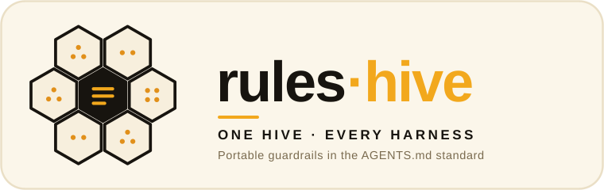

<p align="center">
  
</p>

# rules-hive

> **Harness-agnostic by design.** Guardrails written once as portable
> instruction files, rendered into every agent's native format — `AGENTS.md`,
> `CLAUDE.md`, `.cursor/rules`, `.github/copilot-instructions.md`, `GEMINI.md`,
> and more.

*Part of the **[ai-hive](https://github.com/werkrbee/ai-hive)** family — werkrbee's House of Hives (skills · rules · tools · agents · and more).*

The **instructions** layer of the House of Hives. Where [skills-hive](https://github.com/werkrbee/skills-hive)
holds *what agents can do*, rules-hive holds *how they must behave* — the
always-on charter beneath **Barry**, the King Bee orchestrator. It builds on the
open [AGENTS.md](https://agents.md/) standard and renders the same ruleset into
whatever instruction file each harness reads.

## Rulesets

| Ruleset | Description |
|---------|-------------|
| [**king-charter**](rules/king-charter/AGENTS.md) | The operating constitution — human-in-the-loop for consequential actions, 24×7×365 reliability, safety, and delegation under Barry |

## Repository layout

```text
rules-hive/
├── rules/                        # WHAT the guardrails say — portable source of truth
│   └── king-charter/
│       ├── AGENTS.md             # the canonical ruleset (open standard)
│       └── references/
├── adapters/                     # WHERE they apply — harness taxonomy & overrides
│   ├── claude-code/  cursor/  codex/  gemini-cli/  goose/  opencode/
│   ├── kiro/  databricks-genie-code/  snowflake-cortex-code/
│   └── github-copilot/
│       └── scout/                # sub-harness (child of GitHub Copilot)
├── scripts/
│   ├── install.sh                # render a ruleset into per-harness instruction files
│   └── install.ps1               # Windows equivalent
├── LICENSE
└── README.md
```

Same two-axis model as skills-hive: `rules/` is the portable content; `adapters/`
is the harness taxonomy (Scout nests under GitHub Copilot).

## Install

Instructions are usually **project-scoped**, so the installer writes into the
current directory by default. It renders the ruleset into each harness's native
filename (adding Cursor `.mdc` frontmatter automatically).

```bash
git clone https://github.com/werkrbee/rules-hive.git
cd rules-hive
chmod +x scripts/install.sh

# Into the current project, default harnesses (AGENTS.md, CLAUDE.md, Cursor, Copilot, Gemini)
./scripts/install.sh --dir /path/to/your/project

# Just AGENTS.md + Claude Code
./scripts/install.sh --harness agents --harness claude-code --dir /path/to/project

# User-level (where supported: Claude Code, Codex)
./scripts/install.sh --global --harness claude-code
```

On Windows: `.\scripts\install.ps1 -Dir C:\path\to\project`.

## Instruction files per harness

| Harness | Instruction file (project) |
|---------|----------------------------|
| AGENTS.md standard (Codex, opencode, Kiro, Amp, Jules, …) | `AGENTS.md` |
| Claude Code | `CLAUDE.md` (or `~/.claude/CLAUDE.md`) |
| Cursor | `.cursor/rules/<ruleset>.mdc` |
| GitHub Copilot | `.github/copilot-instructions.md` |
| Gemini CLI | `GEMINI.md` |
| Goose | `.goosehints` |

Filenames evolve — confirm against each harness's current docs. When in doubt,
`AGENTS.md` is the widest-supported shared standard.

## Adding a ruleset

1. Create `rules/<name>/AGENTS.md` (plain Markdown; keep it portable and harness-neutral).
2. Add optional `references/`.
3. Update the rulesets table above.
4. Render it with `./scripts/install.sh --ruleset <name> ...`.

## License

MIT — see [LICENSE](LICENSE).
